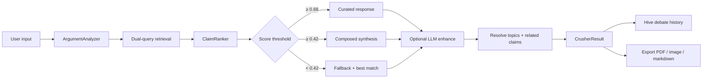

# Argument Crusher — Architecture & RAG Roadmap

The Argument Crusher is the killer feature: paste any leftist argument and get a sourced, fallacy-aware counter-response in seconds.

## Pipeline



## Response order (UI)

1. **Executive Summary** — the punchline first
2. **Steelmanned opponent claim** (from curated KB when matched)
3. **Key evidence**
4. **Sources** (linked citations)
5. **Logical fallacies**
6. **Why this matters for America**
7. **Related topics**
8. **Input analysis** (intent, confidence, phrases)
9. **Curated claim cards** (tap-through to full claim)

## Intent analysis

`ArgumentAnalyzer` normalizes input, expands synonyms (`exploits` → `surplus value`, `profit is theft`), detects topic IDs from keyword maps, assigns human-readable **intent labels**, and flags common fallacy patterns before retrieval runs.

## Retrieval backends (pluggable)

| Backend | Class | Status |
|---------|-------|--------|
| FTS5 | `FtsClaimRetrievalBackend` | Production — SQLite index on claim search text |
| Embedding overlap | `EmbeddingOverlapRetrievalBackend` | Production — token overlap on `Claim.ragText` + `socialistClaimText` |
| Local vectors | `VectorClaimRetrievalBackend` | Production offline — hashed bag-of-words cosine (swap for Vectorize/pgvector later) |

`HybridClaimRetrievalBackend` merges all three with weighted scores. `ClaimRanker` re-ranks using topic match, phrase boosts, tag overlap, and per-phrase claim ID hints.

### Dual-query strategy

Every crush runs retrieval twice:

1. Raw user input
2. Synonym-expanded query from `InputAnalysis.expandedQuery`

Hits are merged (best score wins, duplicates blend).

## How new claims automatically improve the crusher

**No crusher code changes required** when content editors add claims:

1. Add claim JSON to `assets/data/v2/seeds/*.json` (or delta via Supabase sync).
2. On app sync / cold start, `DatabaseService.reindex()` rebuilds the FTS5 index from `claim.searchText`.
3. `EmbeddingOverlapRetrievalBackend` reads all claims on first query — new `ragText` fields immediately participate in token overlap.
4. `ClaimRanker` phrase boosts can be extended in one map for high-traffic phrases; topic keywords in `ArgumentAnalyzer` are optional tuning.

When cloud RAG ships:

1. Set `VectorClaimRetrievalBackend.enabled = true`.
2. Point it at Vectorize or Supabase pgvector embeddings generated from `Claim.ragText`.
3. Hybrid merge already weights vector hits at 1.2× — UI and response builder unchanged.

See also: [ADDING-CLAIMS.md](./ADDING-CLAIMS.md), [content-pipeline.md](./content-pipeline.md).

## Debate history

Every crush saves to Hive:

- Full `CrusherResult` JSON (reloadable from history sheet)
- Mode, intent label, match confidence, matched claim IDs
- Saved to Hive on every crush; optional sync to `profiles.debate_history` when native sign-in is enabled

## Export surfaces

| Format | Implementation |
|--------|----------------|
| Markdown | `CrusherExportService.toMarkdown` — share sheet |
| PDF | Navy/gold branded letter PDF via `printing` package |
| Image card | `CrusherShareCard` captured offstage at 2.5× pixel ratio |

## Configuration

| Threshold | Mode |
|-----------|------|
| ≥ 0.68 | `curated` — single primary claim |
| ≥ 0.42 | `composed` — multi-claim synthesis |
| < 0.42 | Fallback with best available match |

Optional: set `OPENAI_API_KEY` for `LlmCrusherBackend` overlay (`llmEnhanced` mode).

## Key files

```
lib/features/crusher/
  services/
    argument_analyzer.dart      # Intent + fallacy detection
    claim_retrieval_backend.dart # FTS / embedding / vector / hybrid
    crusher_service.dart        # Orchestrator
    debate_history_service.dart # Hive + Supabase sync
    crusher_export_service.dart # PDF / markdown / PNG
  widgets/
    crusher_result_panel.dart   # Response layout
    crusher_share_card.dart     # Branded PNG card
```

## Testing

- `test/crusher_test.dart` — unit tests for analyzer, history, service
- `test/crusher_real_world_test.dart` — 10 real-world leftist arguments with claim ID assertions
- `docs/ARGUMENT-CRUSHER-SAMPLES.md` — sample outputs from the real-world suite